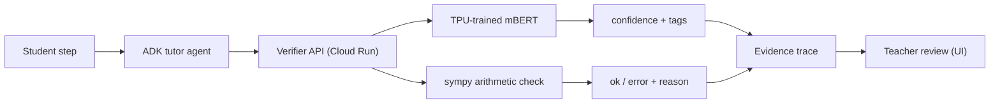
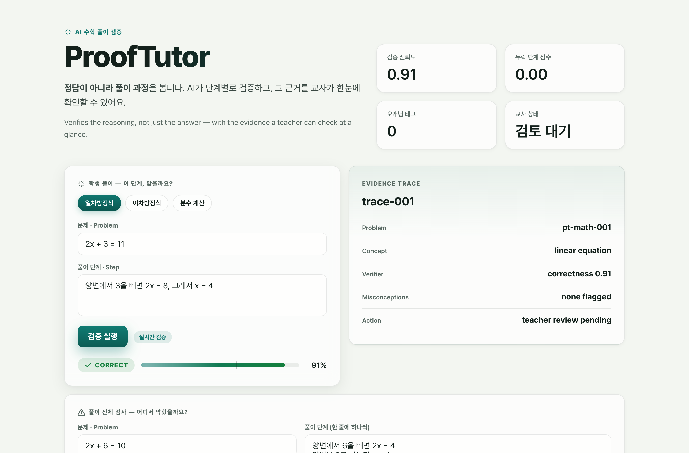
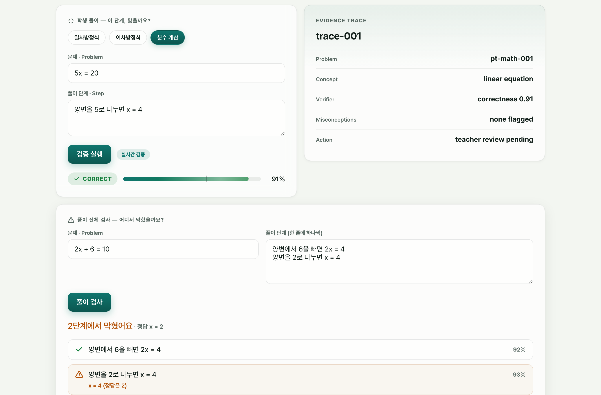
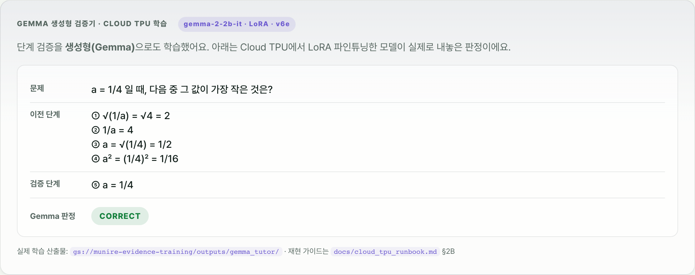
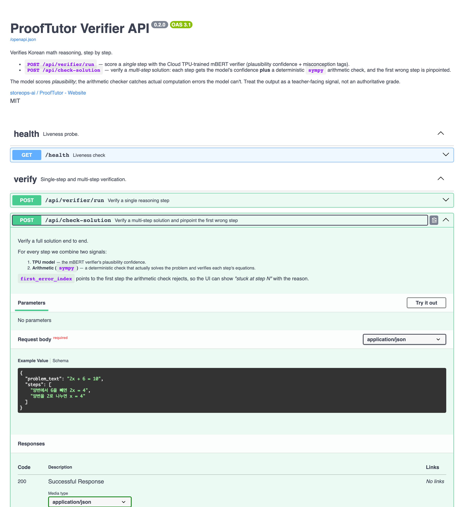

# ProofMetaTutor

> **Explain-first math, verified step by step.** A Cloud TPU-trained verifier that
> checks a student's *reasoning* — not just the answer — and shows teachers the
> evidence before any intervention.

---

## Problem

Most AI tutors answer too fast — the student copies the result and learns nothing.
And a single confidence number can't tell a teacher *where* a solution actually
broke. Math help should check the **reasoning, step by step**, and be honest about
what it knows.

## Solution

ProofMetaTutor is built around two learning-science ideas — **metacognition**
(students explain their reasoning first) and **formative assessment** (feedback
*during* learning, not a final grade):

1. A student writes their solution **step by step**.
2. Each step is checked by a **Cloud TPU-trained verifier** (plausibility) **plus a
   deterministic `sympy` arithmetic check** (does the math actually hold?).
3. The first wrong step is **pinpointed with a reason** ("stuck at step N").
4. Every check is recorded as an inspectable **evidence trace** for the teacher.

The model scores *plausibility*; the arithmetic checker catches real computation
errors the model can't. Treat the output as a teacher-facing signal, not a grade.

---

## Key features

| Feature | What it does |
|---|---|
| **Step verifier** (Cloud TPU) | mBERT fine-tuned on TPU v6e scores each reasoning step's plausibility + misconception tags |
| **Arithmetic check** (`sympy`) | Deterministically solves the problem and verifies each step's equations — catches `x = 4` when the answer is `2` |
| **"Where did it break?"** | Multi-step solution → pinpoints the **first wrong step** with a human-readable reason |
| **Gemma generative verifier** | `gemma-2-2b-it` LoRA fine-tuned on TPU v6e to *explain* verdicts (showcase from the real training run) |
| **Evidence trace** | Every read/score/verdict is logged as an inspectable trace for the teacher |
| **Documented API** | FastAPI with a full OpenAPI/Swagger UI at `/docs` |

---

## How it works

The **TPU boundary is narrow**: Cloud TPU is used for *training/evaluation* only.
Serving (verifier API, web UI) runs on Cloud Run — no TPU at inference time.
See [`docs/architecture.md`](docs/architecture.md).

---

## Cloud TPU training

Two workloads were trained on a **Cloud TPU v6e**, fully reproducible via
[`docs/cloud_tpu_runbook.md`](docs/cloud_tpu_runbook.md):

1. **mBERT step verifier** (JAX/Flax) — 20,127 step-level pairs (AIHub-derived
   positives + Gemma-generated misconception negatives). `val_accuracy 0.880`,
   error-class P/R/F1 `0.909 / 0.760 / 0.828`, with a save+reload self-check
   (`reload_val_accuracy == val_accuracy`) proving the artifact holds trained weights.
2. **Gemma-2-2b-it LoRA** (Keras 3 / JAX) — instruction-tuned to emit a verdict
   (`CORRECT` / `INCORRECT` + reason). Proof-of-pipeline finetune; see
   [`training/gemma_tutor/`](training/gemma_tutor/).

> Reusable as an [Agent Skill](skills/cloud-tpu-training/): provisioning a TPU VM
> and running JAX/Keras training, distilled from this project's runbook.

---

## Tech stack

| Layer | Technology |
|---|---|
| Training | Cloud TPU v6e · JAX/Flax (mBERT) · Keras 3 + KerasHub (Gemma LoRA) |
| Verifier API | FastAPI (flax inference) on Cloud Run, OpenAPI/Swagger |
| Arithmetic | `sympy` |
| Agent | Google ADK (tutor workflow, runs locally) |
| Web UI | Next.js (standalone) on Cloud Run · Pretendard |
| Infra | Artifact Registry · Cloud Build · Cloud Storage |

---

## Screenshots

| Verdict + evidence | "Where did it break?" | Gemma (TPU) verdict |
|---|---|---|
|  |  |  |

API docs (Swagger): 

---

## License

[MIT](LICENSE)
