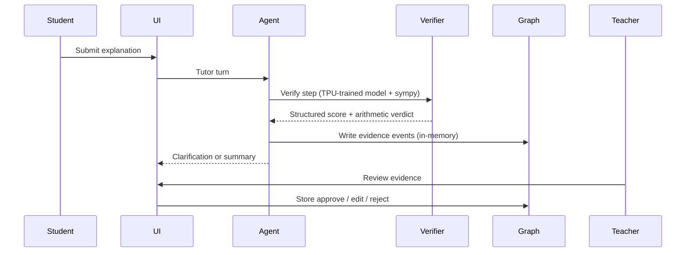

# Architecture

## System Layers (as built)

| Layer | Component | What it actually uses |
|---|---|---|
| Data | AIHub-compatible math records + synthetic negatives | Cloud Storage (GCS) |
| Training | verifier (mBERT) + Gemma LoRA | **Cloud TPU v6e** (TPU VM, JAX/Flax + Keras 3) |
| Serving | verifier API (`/api/verifier/run`, `/api/check-solution`) | **Cloud Run** (FastAPI + flax) |
| Reasoning check | step arithmetic | deterministic `sympy` checker |
| Agent | tutor workflow (explain-first) | Google **ADK** (runs locally) |
| Evidence | per-request trace | **in-memory** trace store (`services/backend/app/evidence_graph.py`) |
| Safety | input/output guardrails + teacher gate | local guardrail module (`model_armor.py`, `teacher_gate.py`) |
| UI | student + teacher views | Next.js on **Cloud Run** |

## TPU boundary

The TPU boundary is intentionally narrow: it covers **verifier/Gemma training and
batch evaluation** on Cloud TPU v6e. Everything else (serving, agent, UI) runs on
Cloud Run and standard Python — no TPU needed at inference time.

## Agent tool flow

## Deployment (current)

- **Cloud TPU v6e (TPU VM)** — verifier + Gemma LoRA training (see `docs/cloud_tpu_runbook.md`).
- **Cloud Run** — verifier API (`services/verifier_api`) and the Next.js UI (`apps/web`).
- **Artifact Registry + Cloud Build** — container build/push for the above.
- **GCS** — datasets and trained artifacts.

The evidence store is in-memory (per-process). A durable graph store is **not**
part of this build.
